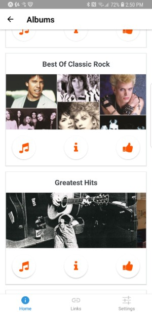

# React Native/Expo Music App

Music app for searching artists and playing previews using the Deezer API. Built from [Udemy Course](https://www.udemy.com/react-native-quickstart-build-real-app-with-deezer-api/])

 

## Fastest way to run on phone:

1. Install expo client app and scan this qr mark:

_Typing @sschottler/music-app inside of Expo Client will also open this project_

I didn't bother changing the default splash screen so it'll just be a blank square for a few seconds.

## To run code on your phone:

1. `git clone https://github.com/sschottler/music-app.git`
2. `npm install`
3. get free deezer api key [here](https://market.mashape.com/deezerdevs/deezer-1)
4. set your api key in .env file
5. `npm start`
6. install expo client on your phone and scan the qrmark that pops up

**if it generates the wrong URL due to docker/virtualbox/etc. you can override that in the .env file**

You can also build an apk and install on your device with adb. instructions here:

https://docs.expo.io/versions/latest/distribution/building-standalone-apps
